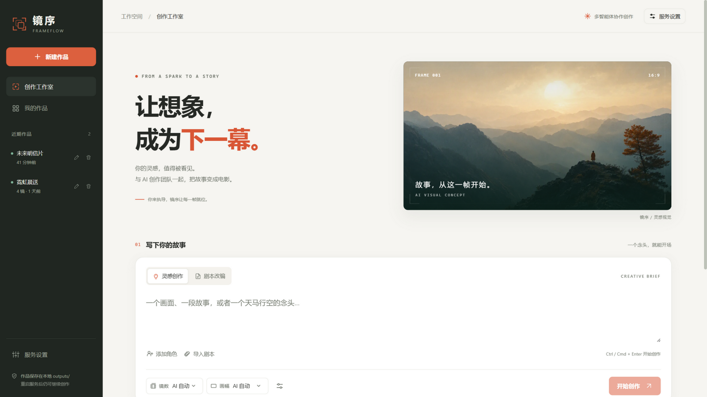
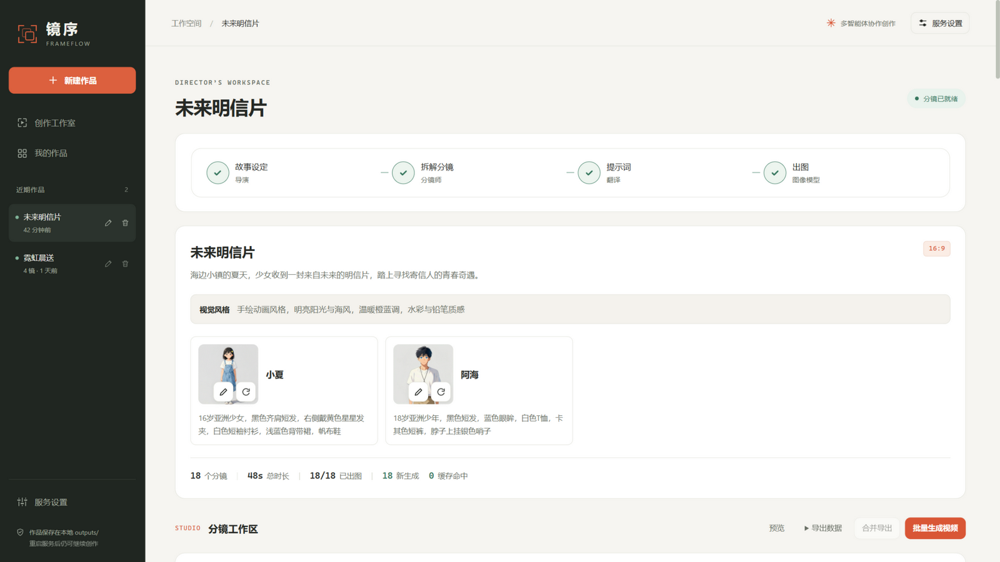
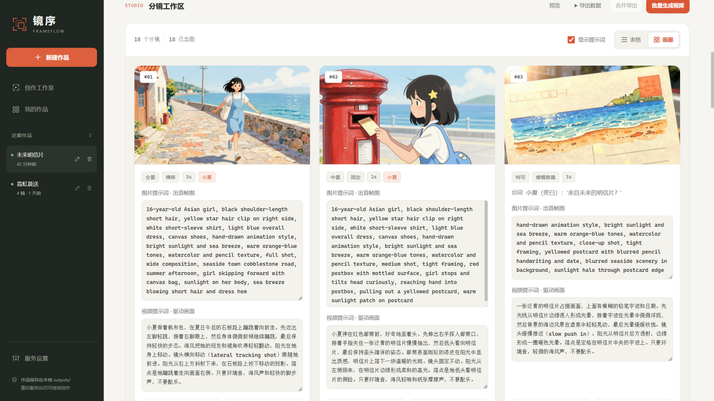
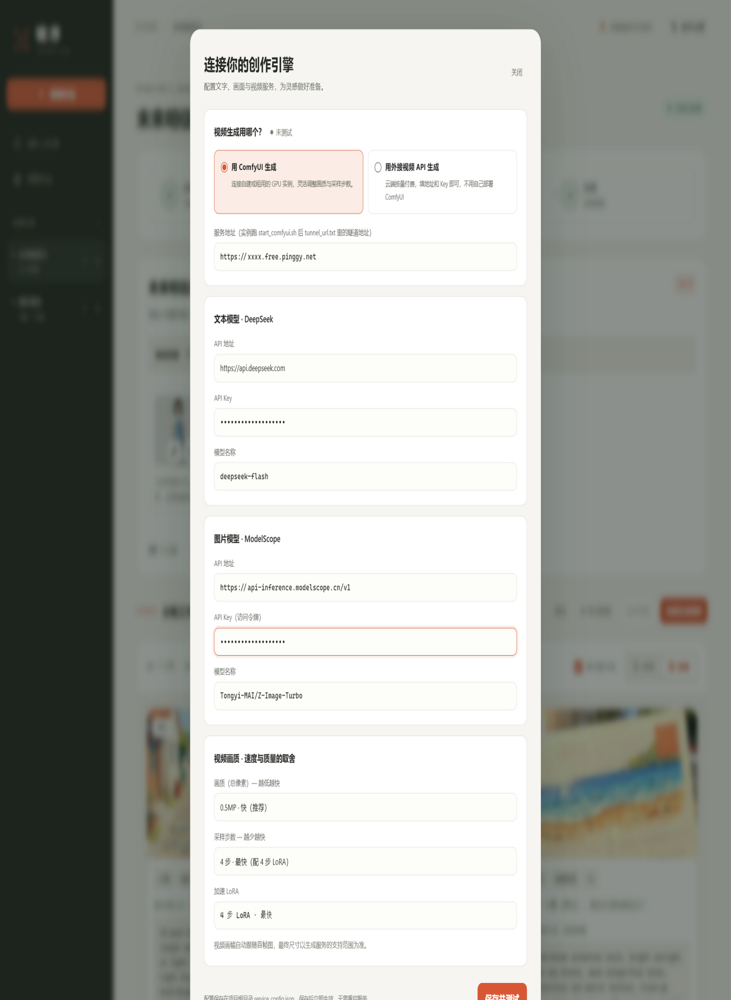
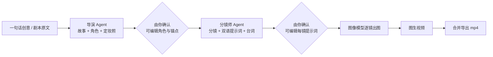

<div align="center">

# 镜序 FRAMEFLOW

**从一句话，到一部片。**

把一个创意交给 AI 创作团队：写故事、定角色、拆分镜、出画面、动起来——而你在每一幕之间掌舵。

`Python 3.10+` · `FastAPI` · `Vue 3` · `DeepSeek` · `ModelScope` · `ComfyUI`

</div>

---

## 这是什么

一个跑在本地的 **AI 短片创作工作台**。输入一句话创意（或整篇小说），多智能体流水线会：

1. **导演 Agent** 写出故事设定、视觉风格和角色锚点，并为每个角色生成定妆照；
2. **你确认**，可以改角色名字、改提示词、重新生成定妆照；
3. **分镜师 Agent** 拆解分镜，给每一镜生成图片提示词、视频提示词、台词、运镜和时长；
4. **你确认**，每一格提示词都可以手改；
5. **图像模型** 逐镜出图，**图生视频模型** 让画面动起来；
6. 一键**合并导出**成片，或导出分镜 JSON 回到别的工具里继续加工。

整个过程分阶段停在原地等你验收，不满意就改，满意再继续。

| 创作工作室 | 角色与故事 |
| --- | --- |
|  |  |
| **分镜画廊** | **服务配置** |
|  |  |

## 工作流程



## 快速开始

### 1. 环境要求

- Python **3.10+**（代码用了 `str | None` 这类新语法）
- Node.js **18+**（仅前端开发模式需要；用生产模式可跳过）
- ffmpeg：`pip install` 时经 `imageio-ffmpeg` 自动带上，无需系统安装

### 2. 安装

```bash
git clone https://github.com/wenliu3/jingxu-frameflow.git
cd jingxu-frameflow
pip install -r requirements.txt

cd web
npm install
cd ..
```

### 3. 启动

**开发模式（改前端代码实时热更新）：**

```bash
# 终端 1：后端（端口 8000）
python -m uvicorn server.app:app --host 127.0.0.1 --port 8000

# 终端 2：前端（端口 5173，已配置代理转发 /api 与 /files 到 8000）
cd web && npm run dev
```

浏览器打开 <http://localhost:5173>。

**生产模式（单服务，更省事）：**

```bash
cd web && npm run build && cd ..
python -m uvicorn server.app:app --host 127.0.0.1 --port 8000
```

浏览器打开 <http://127.0.0.1:8000> 即可，后端会直接伺服 `web/dist` 静态文件。

### 4. 填服务配置（关键一步）

点右上角 **服务设置**，保存后写入项目根目录 `service_config.json`，立即生效，无需重启。
也可以复制 `.env.example` 为 `.env` 用环境变量兜底（优先级：面板 > 环境变量 > 内置默认值）。

| 用途 | 服务 | 需要填 | 去哪获取 |
| --- | --- | --- | --- |
| 故事 / 分镜 / 翻译（文本模型） | DeepSeek API | API Key，模型默认 `deepseek-flash` | [platform.deepseek.com](https://platform.deepseek.com) |
| 角色定妆照 / 分镜出图（图片模型） | ModelScope API-Inference | 访问令牌 `ms-...`，模型默认 `Tongyi-MAI/Z-Image-Turbo` | [modelscope.cn](https://modelscope.cn) → 个人中心 → 访问令牌（需绑定阿里云并实名认证） |
| 图生视频（视频模型） | 三选一，见下一节 | 见下一节 | — |

> ModelScope 图像 API 是异步接口（提交拿 task_id → 轮询取图），本项目已自动处理；
> 想要更高质量可把模型名换成 `Qwen/Qwen-Image-2512`，速度会慢一些。

## 图生视频的三种方案

### 方案 A：外接视频 API —— 无需 GPU，最简单

面板里选 **「用外接视频 API 生成」**，填三项：

| 字段 | 示例值 |
| --- | --- |
| API 地址 | `https://api.siliconflow.cn/v1` |
| API Key | 在 [siliconflow.cn](https://siliconflow.cn) 控制台创建 |
| 模型名称 | `MiniMax/Hailuo-02` |

走硅基流动风格的异步任务协议，首帧图以 base64 随请求提交。
想接其他厂商？协议差异都收敛在 `video_provider.py` 的 `ApiVideoProvider` 一个类里，改它即可。

### 方案 B：租 GPU 服务器自建 ComfyUI（AutoDL 等）

适合想自己控制画质、不计按时长付费的场景。租一台带 **PyTorch + CUDA 镜像** 的 Linux GPU 机器，然后：

```bash
# 服务器上执行（脚本幂等，重复执行会跳过已装好的部分）
bash deploy_comfyui.sh /root/autodl-tmp/comfyui   # 建议放数据盘

# 海外机器改走 HuggingFace 下载：
MODEL_SOURCE=hf bash deploy_comfyui.sh
```

脚本会装好 ComfyUI，并从 ModelScope / HuggingFace 下载 MiniMax-H3 图生视频全套模型
（扩散模型、Qwen3-VL 文本编码器、视频/音频 VAE、4 步与 8 步加速 LoRA）。

完成后把平台的**公网访问地址**填进面板「服务地址」→ 点「保存并测试」，
看到绿点 **已连接** 即可。画质与速度在面板底部三个下拉框里调：

| 选项 | 说明 |
| --- | --- |
| 画质（总像素） | `0.4MP` 最快 → `0.98MP` 最清晰，默认 `0.5MP` |
| 采样步数 | 步数越少越快，4 步需配 4 步加速 LoRA |
| 加速 LoRA | 4 步最快 / 8 步均衡 |

### 方案 C：ModelScope 魔搭免费实例（PAI-DSW Notebook）

白嫖 GPU 的路线，本项目的原始开发环境就是这个：

1. 在 [modelscope.cn](https://modelscope.cn) 开一个 GPU 实例（PAI-DSW Notebook，免费额度即可）；
2. 进入 JupyterLab 终端，把 `deploy_comfyui_ms.sh` 上传到 `/mnt/workspace` 并执行：
   ```bash
   bash deploy_comfyui_ms.sh     # 首次：部署 ComfyUI + 下载全套模型 + 建隧道
   ```
3. 之后**每次实例冷启动**只需：
   ```bash
   bash /mnt/workspace/start_comfyui.sh
   cat /mnt/workspace/tunnel_url.txt     # 拿公网隧道地址
   ```
4. 把隧道地址（形如 `https://xxxx.free.pinggy.net`）填进面板「服务地址」。

> 注意：DSW 网关地址需要阿里云登录态，本机程序直连必须用脚本建好的 pinggy 隧道地址；
> 免费隧道地址约 60 分钟会变，变了就重新 `cat tunnel_url.txt` 再填一次。
> 详细的穿透原理与实测对比见 `comfyui-tunnel-guide.md`。

| | 方案 A：外接 API | 方案 B：租卡自建 | 方案 C：魔搭免费实例 |
| --- | --- | --- | --- |
| 前置成本 | 注册即用 | 租金 | 免费额度 |
| 画质控制 | 固定 | 可调（步数/画质/LoRA） | 可调（同 B） |
| 稳定性 | 高 | 高 | 实例会回收，地址会过期 |
| 适合 | 先跑通、试效果 | 大量出片 | 白嫖体验完整流程 |

## 使用界面跑一条完整流水线

1. **新建作品**：输入一句话创意（或切「剧本改编」粘贴整篇小说，可预先「添加角色」锁定人物设定），选画幅与镜数（或交给 AI 自定）；
2. **故事设定阶段**：读故事、看角色定妆照。点角色卡上的 ✏️ 可以改名字和角色锚点提示词，改完点旁边的 🔄 重新生成定妆照。满意后点 **继续 · 拆解分镜与提示词**；
3. **分镜阶段**：逐镜检查图片提示词、视频提示词和台词，面板里可直接编辑（改过的分镜出图时会自动重画）。满意后点 **继续 · 生成图片**；
4. **出图阶段**：逐镜出图实时刷新，单镜不满意可「重新生成图片」或「改写提示词并出图」；
5. **视频阶段**：单镜「生成视频」或 **批量生成视频**，完成后 **合并导出** 下载成片。

每个作品的产物都在 `outputs/<task_id>/`：`project.json`（故事与角色）、`shots.json`（分镜数据）、
`images/`、`videos/`、`preview.html`（可直接浏览器打开的分镜预览页）。
删除作品会先移入 `outputs/_trash/` 回收站，不会立刻消失。

## 不开前端也能跑（CLI）

```bash
# 只生成分镜脚本与提示词，不需要图像模型密钥
python main.py "雨夜便利店的一场重逢" --shots 6 --text-only

# 完整跑到出图
python main.py "赛博朋克城市的清晨" --shots 8 --ratio 9:16

# 对已有作品批量图生视频（需要 ComfyUI 或外接视频 API）
python video_agent.py outputs/<task_id>
```

## 配置自检

```bash
python doctor.py            # 查配置 + DeepSeek 连通性（密钥只显示首尾）
python doctor.py --image    # 额外真实出图一次验证 ModelScope（会消耗额度）
```

## 项目结构

```
ai_video_multiagent/
├─ server/app.py            # FastAPI 服务：任务生命周期、阶段流转、视频任务、合并导出、服务配置
├─ main.py                  # CLI 入口
├─ pipeline.py              # 流水线：导演 → 定妆照 → 分镜 → 出图
├─ agents.py                # 导演 / 分镜师 Agent 的提示词与 JSON 解析
├─ llm.py                   # DeepSeek 文本调用（重试、JSON Output 兜底）
├─ image_provider.py        # ModelScope 图像 Provider（异步任务轮询）
├─ video_provider.py        # ComfyUI(MiniMax H3) 与外接 API 两种视频 Provider
├─ video_agent.py           # 命令行批量图生视频（断点续跑）
├─ doctor.py                # 配置自检
├─ schemas.py               # Project / Shot 数据结构
├─ deploy_comfyui.sh        # 租卡环境一键部署（AutoDL / 有公网 IP 的服务器）
├─ deploy_comfyui_ms.sh     # ModelScope DSW 一键部署 + pinggy 隧道
├─ comfyui-tunnel-guide.md  # DSW 内网穿透原理与实测对比
├─ comfyui/h3_i2v_api.json  # 图生视频 ComfyUI 工作流（API 格式）
├─ web/                     # Vue 3 + Vite 前端
└─ outputs/                 # 作品产物（本地数据，不入库）
```

## 常见问题

**面板里 ComfyUI 显示红点「连不上」？**
实例没在跑或隧道过期。在实例里重跑 `start_comfyui.sh`，拿新的 `tunnel_url.txt` 地址填进面板。
可以先 `curl -m 10 https://<隧道地址>/system_stats` 验证通不通。

**生成失败了去哪看原因？**
页面顶部的红色错误框点「查看错误详情」有完整 traceback；文本模型空返回、JSON 解析失败等都会重试兜底。

**隧道地址为什么总变？**
pinggy 免费隧道约 60 分钟轮换一次子域名，实例重启也会换。固定公网 IP（方案 B）没有这个问题。

**重启服务后作品还在吗？**
在。后端启动时会扫 `outputs/` 把所有历史任务认回来，包括停在「待确认故事」阶段、还没拆分镜的作品。

**我的 API Key 安全吗？**
Key 保存在本机的 `service_config.json`（或 `.env`），已被 `.gitignore` 排除，不会随仓库上传。
上传 GitHub 前请确认这两个文件确实没被 `git add -f` 进去；万一误传，立刻去对应平台吊销重置。

## License

本项目基于 [MIT License](LICENSE) 发布——AI 生成的代码与工作流脚本可自由使用、修改与二次分发，请自行承担生成内容相关的合规责任。
