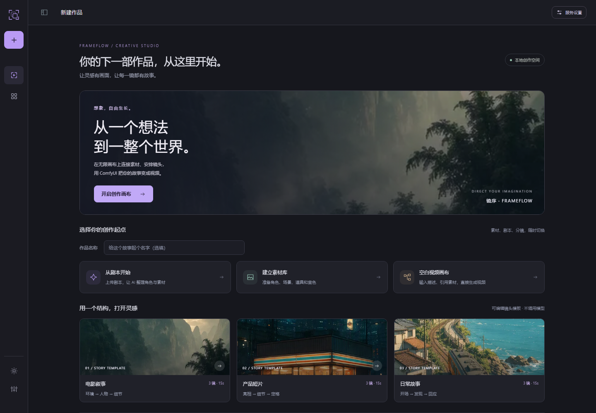
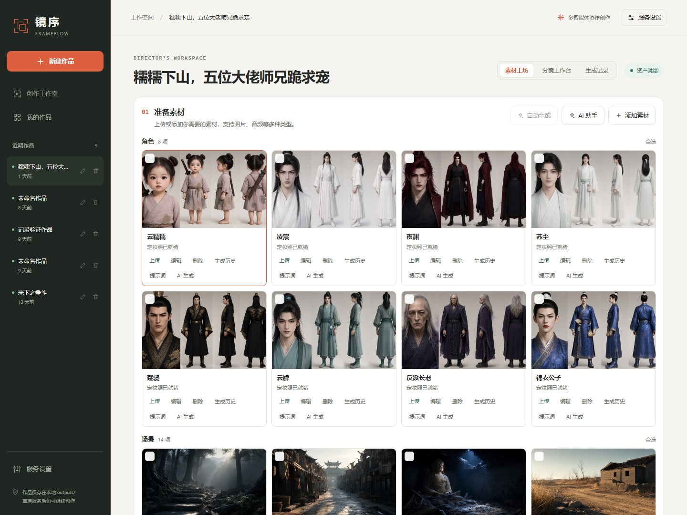
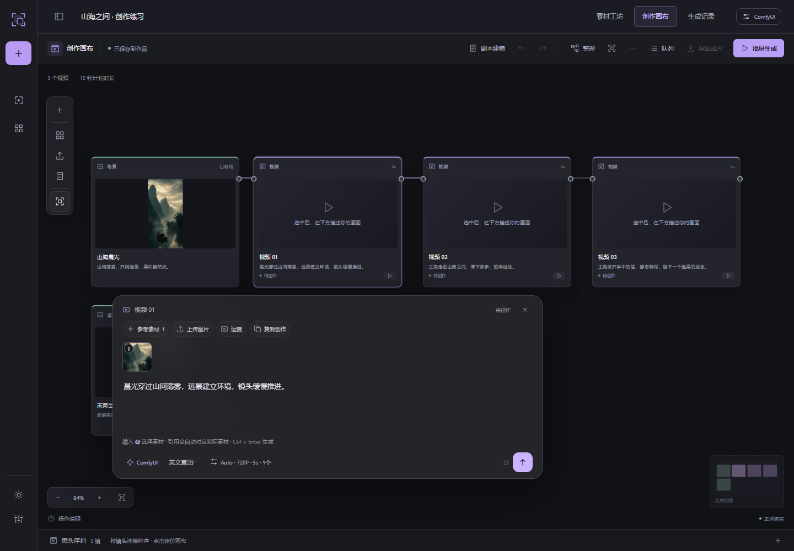
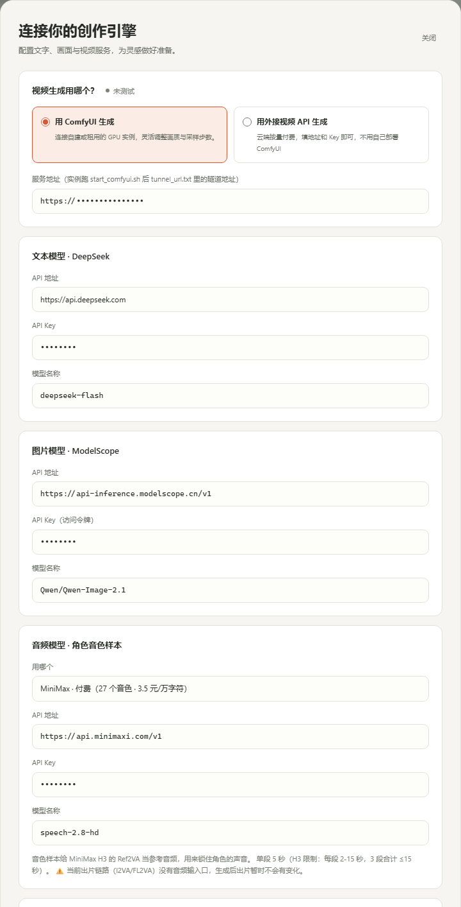
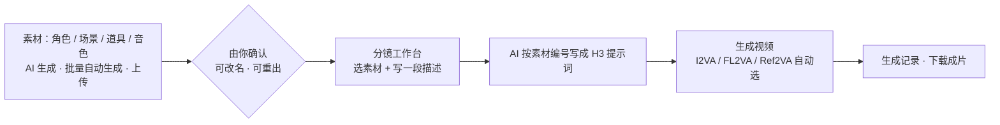

<div align="center">

# 镜序 FRAMEFLOW

**从一句话，到一部片。**

把一个创意交给 AI 创作团队：定角色、备素材、出画面、动起来——而你在每一幕之间掌舵。

`Python 3.10+` · `FastAPI` · `Vue 3` · `DeepSeek` · `ModelScope` · `MiniMax` · `ComfyUI`

</div>

---

## 这是什么

一个跑在本地的 **AI 短片创作工作台**，围绕「素材」组织创作：

1. **备素材**（素材工坊）：角色、场景、道具、其他图片、角色音色——每一项都能单独 AI 生成，
   也能勾选一批后一键**「自动生成」**（图像 4 路并发、音色 2 路并发，自带限流退避与 RPM 节流）；
2. **写这一段**（分镜工作台）：从素材池里挑（按角色 / 场景 / 道具**分组**、可**搜索**，
   最多 9 张图 + 音频），写一段白话描述——或让 AI 按素材编号写成 H3 提示词——生成视频；
3. **看产出**（生成记录）：这个作品出过的每一段，用了哪些素材、哪句提示词、什么参数，可下载。

> 从一句话直接开跑的多智能体老流水线（导演 Agent → 分镜 → 批量出图 → 合并导出）仍在代码里：
> CLI 可以直接跑（见下文），老作品在工作台里会看到「由你决定下一步」的推进卡片。
> 界面主线已切到上面的「素材优先」三步。

| 创作工作室 | 素材工坊 |
| --- | --- |
|  |  |
| **分镜工作台** | **服务配置** |
|  |  |

## 工作流程


```mermaid
flowchart LR
    A[素材：角色 / 场景 / 道具 / 音色<br/>AI 生成 · 批量自动生成 · 上传] --> B{由你确认<br/>可改名 · 可重出}
    B --> C[分镜工作台<br/>选素材 + 写一段描述]
    C --> D[AI 按素材编号写成 H3 提示词]
    D --> E[生成视频<br/>I2VA / FL2VA / Ref2VA 自动选]
    E --> F[生成记录 · 下载成片]
```

## 快速开始

### 1. 环境要求

- Python **3.10+**（代码用了 `str | None` 这类新语法）
- Node.js **18+**（仅前端开发模式需要；用生产模式可跳过）
- ffmpeg：`pip install` 时经 `imageio-ffmpeg` 自动带上，无需系统安装

### 2. 安装

```bash
git clone https://github.com/wenliu3/jingxu-frameflow.git
cd jingxu-frameflow
pip install -r requirements.txt

cd web
npm install
cd ..
```

### 3. 启动

**开发模式（改前端代码实时热更新）：**

```bash
# 终端 1：后端（端口 8000）
python -m uvicorn server.app:app --host 127.0.0.1 --port 8000

# 终端 2：前端（端口 5173，已配置代理转发 /api 与 /files 到 8000）
cd web && npm run dev
```

浏览器打开 <http://localhost:5173>。

**生产模式（单服务，更省事）：**

```bash
cd web && npm run build && cd ..
python -m uvicorn server.app:app --host 127.0.0.1 --port 8000
```

浏览器打开 <http://127.0.0.1:8000> 即可，后端会直接伺服 `web/dist` 静态文件。

### 4. 填服务配置（关键一步）

点右上角 **服务设置**，保存后写入项目根目录 `service_config.json`，立即生效，无需重启。
也可以复制 `.env.example` 为 `.env` 用环境变量兜底（优先级：面板 > 环境变量 > 内置默认值）。

| 用途 | 服务 | 需要填 | 去哪获取 |
| --- | --- | --- | --- |
| 故事 / 提示词优化（文本模型） | DeepSeek API | API Key，模型默认 `deepseek-flash` | [platform.deepseek.com](https://platform.deepseek.com) |
| 素材出图（图片模型） | ModelScope API-Inference | 访问令牌 `ms-...`，模型默认 `Tongyi-MAI/Z-Image-Turbo` | [modelscope.cn](https://modelscope.cn) → 个人中心 → 访问令牌（需绑定阿里云并实名认证） |
| 角色音色样本（语音模型） | edge-tts（免费）或 MiniMax | MiniMax 需填 API Key，模型默认 `speech-2.8-hd` | [platform.minimaxi.com](https://platform.minimaxi.com) → 账户管理 → API Keys |
| 图生视频（视频模型） | 三选一，见下一节 | 见下一节 | — |

> ModelScope 图像 API 是异步接口（提交拿 task_id → 轮询取图），本项目已自动处理。
> 换模型就改「模型名称」一个字段：`Qwen/Qwen-Image-2.1`（2026-09 开源，写实更强、略慢，实测可用）
> 或 `Qwen/Qwen-Image-2512`（更懂中文与文字渲染，但**出人物不如 Z-Image-Turbo**）。
> 免费额度参考：每账号每天 2000 次 API-Inference 调用、单模型 500 次/天。

## 图生视频的三种方案

### 方案 A：外接视频 API —— 无需 GPU，最简单

面板里选 **「用外接视频 API 生成」**，填三项：

| 字段 | 示例值 |
| --- | --- |
| API 地址 | `https://api.siliconflow.cn/v1` |
| API Key | 在 [siliconflow.cn](https://siliconflow.cn) 控制台创建 |
| 模型名称 | `MiniMax/Hailuo-02` |

走硅基流动风格的异步任务协议，首帧图以 base64 随请求提交。
想接其他厂商？协议差异都收敛在 `video_provider.py` 的 `ApiVideoProvider` 一个类里，改它即可。

### 方案 B：租 GPU 服务器自建 ComfyUI（AutoDL 等）

适合想自己控制画质、不计按时长付费的场景。租一台带 **PyTorch + CUDA 镜像** 的 Linux GPU 机器，然后：

```bash
# 服务器上执行（脚本幂等，重复执行会跳过已装好的部分）
bash deploy_comfyui.sh /root/autodl-tmp/comfyui   # 建议放数据盘

# 海外机器改走 HuggingFace 下载：
MODEL_SOURCE=hf bash deploy_comfyui.sh
```

脚本会装好 ComfyUI，并从 ModelScope / HuggingFace 下载 MiniMax-H3 图生视频全套模型
（扩散模型、Qwen3-VL 文本编码器、视频/音频 VAE、4 步与 8 步加速 LoRA）。

完成后把平台的**公网访问地址**填进面板「服务地址」→ 点「保存并测试」，
看到绿点 **已连接** 即可。画质与速度在面板底部三个下拉框里调：

| 选项 | 说明 |
| --- | --- |
| 画质（总像素） | `0.4MP` 最快 → `0.98MP` 最清晰，默认 `0.5MP` |
| 采样步数 | 步数越少越快，4 步需配 4 步加速 LoRA |
| 加速 LoRA | 4 步最快 / 8 步均衡 |

### 方案 C：ModelScope 魔搭免费实例（PAI-DSW Notebook）

白嫖 GPU 的路线，本项目的原始开发环境就是这个：

1. 在 [modelscope.cn](https://modelscope.cn) 开一个 GPU 实例（PAI-DSW Notebook，免费额度即可）；
2. 进入 JupyterLab 终端，把 `deploy_comfyui_ms.sh` 上传到 `/mnt/workspace` 并执行：
   ```bash
   bash deploy_comfyui_ms.sh     # 首次：部署 ComfyUI + 下载全套模型 + 建隧道
   ```
3. 之后**每次实例冷启动**只需：
   ```bash
   bash /mnt/workspace/start_comfyui.sh
   cat /mnt/workspace/tunnel_url.txt     # 拿公网隧道地址
   ```
4. 把隧道地址（形如 `https://xxxx.free.pinggy.net`）填进面板「服务地址」。

> 注意：DSW 网关地址需要阿里云登录态，本机程序直连必须用脚本建好的 pinggy 隧道地址；
> 免费隧道地址约 60 分钟会变，变了就重新 `cat tunnel_url.txt` 再填一次。
> 详细的穿透原理与实测对比见 [`docs/comfyui-tunnel-guide.md`](docs/comfyui-tunnel-guide.md)。

| | 方案 A：外接 API | 方案 B：租卡自建 | 方案 C：魔搭免费实例 |
| --- | --- | --- | --- |
| 前置成本 | 注册即用 | 租金 | 免费额度 |
| 画质控制 | 固定 | 可调（步数/画质/LoRA） | 可调（同 B） |
| 稳定性 | 高 | 高 | 实例会回收，地址会过期 |
| 适合 | 先跑通、试效果 | 大量出片 | 白嫖体验完整流程 |

### 补充：喂给 H3 的三种图，和它们背后的 H3 官方模式

**界面不再让你选模式**（2026-09 已合并进出片链路）：由「选了什么素材 + 有没有勾首尾帧」
自动决定用哪条。下面三种用法的区别仍然值得搞清——它决定你该往素材池里挑什么图：

| 用法 | 起点图 | 要先出分镜图吗 | 对应 H3 官方模式 |
| --- | --- | --- | --- |
| **分镜图生视频** | 本镜的分镜图 | **要** | I2VA（1 张图锚定 0.00s） |
| **首尾帧** | 上一镜尾帧 + 本镜分镜图 | 要 | FL2VA（2 张图锚定首尾） |
| **无分镜图生视频** | **角色定妆照**（优先用全身那张） | **不要** | I2VA + 人物图当首帧 |

三种共用**同一套 fl2va 权重**，区别只在选哪张图当起点。

> **「无分镜图生视频」省掉的是出图额度和时间**：只要有角色定妆照，一个镜头都不用出图。
> 但它仍然走 I2VA——那张定妆照会被当成**第一帧画面**，官方要求把构图和空间一起锚定，
> 所以画面构图会受定妆照约束。要「只锁身份、放开构图」，得看下面的 Ref2VA。

H3 官方其实有**四种输入模式**，上面覆盖到三种用法，还差一种：

| 官方模式 | 输入 | 构图控制权 | 权重 |
| --- | --- | --- | --- |
| T2VA 文生视频 | 不喂图 | 全交给模型 | fl2va |
| I2VA 首帧生视频 | 1 张图，锚定 0.00s | 被那张图钉死 | fl2va |
| FL2VA 首尾帧 | 2 张图，锚定首尾 | 被两张图夹住 | fl2va |
| **Ref2VA 全能参考** | ≤9 图 + ≤3 视频 + ≤3 音频 | **图只锁身份，构图交给提示词** | **ref2va** |

**Ref2VA 是另一套权重**（不是上面任一模式里的开关），只有它能做到
「用人物图锁身份、构图完全交给提示词」。**已接入**：在「服务设置 → 视频工作流」里
切成 `Ref2VA · 全能参考` 即可（默认仍是 `I2V`）。切换前要先在 ComfyUI 实例上下
`ref2va` 那份权重，细节见 [`docs/REF2VA.md`](docs/REF2VA.md)。

> ⚠️ 别把「首尾帧」当成 Ref2VA。首尾帧给的两张图仍然是**画面帧**，会锁定构图；
> Ref2VA 给的图是**角色参考图**，只锁人物身份，机位景别全部由提示词决定。

> 提示词的写法按 H3 官方规范：**正文用英文**，只有台词保留原语言。
> 官方指南只有英文版（`base-en.txt` / `ref-en.txt`），中文口播本身也是模型已知弱点。

## 使用界面跑一段视频

1. **新建作品 → 备素材**：加角色 / 场景 / 道具 / 其他图片 / 音色。每一项都能「上传」，
   也能交给 AI 生成（卡片上的「AI 生成」；先用「提示词」攒一段描述，出图就用它）。
   角色会同时出**正面定妆照**（下游出片真正用的那张）和**四视图设定图**（给你核对形象）；
2. **批量出图**：素材多时不用一个个点——勾选卡片左上角的复选框（或分组标题的「全选」），
   点右上角**自动生成**，按每张卡片的提示词挨个出（见下一节）；
3. **分镜工作台**：左边素材池按**角色 / 场景 / 道具 / 其他图片分组**，支持**搜索**；
   点一下把素材选进这一段视频（Ref2VA 最多 9 张图；I2V 只吃一张，再选会替上一张）。
   右边写一段白话描述，「让 AI 帮写」会按素材编号写成 H3 提示词；确认时长与清晰度后**生成视频**；
4. **生成记录**：这一段用了哪些素材、哪句提示词、什么参数，可下载成片。

每个作品的产物都在 `outputs/<task_id>/`：`project.json`（角色与素材）、`characters/`（定妆照 + 音色样本）、
`assets/`（场景 / 道具 / 其他图片）、`preview.html`（可直接浏览器打开的分镜预览页）；
出过片的还会有 `segments/`（每段视频 + 它用了什么素材的边车记录）。
删除作品会先移入 `outputs/_trash/` 回收站，不会立刻消失。

## 批量「自动生成」

勾选卡片左上角的复选框（或分组标题的「全选」）→ 点右上角**自动生成**，就会按每张卡片上的
提示词挨个出：

- **角色**出 2 张（定妆照 + 四视图设定图）；场景 / 道具 / 其他图片各 1 张；音色合成 1 段样本；
- **图像 4 路并发**——魔搭免费 API 不承诺并发，所以内置了 429 退避重试
  （1.5s → 3s → 6s → 12s，服务端日志里能看到"429 限流，x.xs 后重试"）；
- **音色 2 路并发 + 每分钟节流**——MiniMax 语音合成只按 RPM 限流（免费 10 / 充值 20），
  默认节奏约 18 次/分钟；如果你用的是免费档，把前端 `CreateWorkbench.vue` 里的
  `VOICE_GAP_MS` 从 `3200` 改成 `6000`；
- 随时可**停止**（不再开新项，已经发出去的跑完就停）；成功的自动取消勾选，失败的留着方便重试；
- 日额度参考：魔搭每账号每天 2000 次 API-Inference 调用、单模型 500 次/天。

## 不开前端也能跑（CLI）

```bash
# 只生成分镜脚本与提示词，不需要图像模型密钥
python main.py "雨夜便利店的一场重逢" --shots 6 --text-only

# 完整跑到出图
python main.py "赛博朋克城市的清晨" --shots 8 --ratio 9:16

# 对已有作品批量图生视频（需要 ComfyUI 或外接视频 API）
python video_agent.py outputs/<task_id>
```

## 配置自检

```bash
python doctor.py            # 查配置 + DeepSeek 连通性（密钥只显示首尾）
python doctor.py --image    # 额外真实出图一次验证 ModelScope（会消耗额度）
```

## 项目结构

```
ai_video_multiagent/
├─ server/app.py            # FastAPI 服务：任务生命周期、阶段流转、视频任务、合并导出、服务配置
├─ main.py                  # CLI 入口
├─ pipeline.py              # 流水线：导演 → 定妆照 → 分镜 → 出图
├─ agents.py                # 导演 / 分镜师 Agent 的提示词与 JSON 解析
├─ llm.py                   # DeepSeek 文本调用（重试、JSON Output 兜底）
├─ image_provider.py        # ModelScope 图像 Provider（异步任务轮询）
├─ video_provider.py        # ComfyUI(MiniMax H3) 与外接 API 两种视频 Provider
├─ video_agent.py           # 命令行批量图生视频（断点续跑）
├─ doctor.py                # 配置自检
├─ schemas.py               # Project / Shot 数据结构
├─ tts.py                   # 音色挑选与语音合成
├─ ref_plan.py              # H3 提示词编排与审计（分段时长、[Shot N] 标记）
├─ deploy_comfyui.sh        # 租卡环境一键部署（AutoDL / 有公网 IP 的服务器）
├─ deploy_comfyui_ms.sh     # ModelScope DSW 一键部署 + pinggy 隧道
├─ comfyui/                 # ComfyUI 工作流模板（h3_i2v_api.json 等，API 格式）
├─ docs/                    # 文档：H3 提示词规则、隧道指南、REF2VA 接入指引
├─ dev/                     # 开发期验证脚本（接口 / 界面 / E2E，非产品代码，见 dev/README.md）
├─ web/                     # Vue 3 + Vite 前端
└─ outputs/                 # 作品产物（本地数据，不入库）
```

## 常见问题

**面板里 ComfyUI 显示红点「连不上」？**
实例没在跑或隧道过期。在实例里重跑 `start_comfyui.sh`，拿新的 `tunnel_url.txt` 地址填进面板。
可以先 `curl -m 10 https://<隧道地址>/system_stats` 验证通不通。

**生成失败了去哪看原因？**
页面顶部的红色错误框点「查看错误详情」有完整 traceback；文本模型空返回、JSON 解析失败等都会重试兜底。

**批量生成素材会不会触发限流？**
图像 4 路并发已经贴着魔搭免费 API 的舒适区，遇到 429 会自动退避重试（服务端日志里能看到）；
音色走 MiniMax 的 RPM 限流，脚本里已按分钟节流。真正的天花板是**日额度**（魔搭单模型 500 次/天），
用光要等第二天，或把模型名换成另一个（额度按模型单独算）。

**隧道地址为什么总变？**
pinggy 免费隧道约 60 分钟轮换一次子域名，实例重启也会换。固定公网 IP（方案 B）没有这个问题。

**重启服务后作品还在吗？**
在。后端启动时会扫 `outputs/` 把所有历史任务认回来，包括停在「待确认故事」阶段、还没拆分镜的作品。

**我的 API Key 安全吗？**
Key 保存在本机的 `service_config.json`（或 `.env`），已被 `.gitignore` 排除，不会随仓库上传。
上传 GitHub 前请确认这两个文件确实没被 `git add -f` 进去；万一误传，立刻去对应平台吊销重置。

## License

本项目基于 [MIT License](LICENSE) 发布——AI 生成的代码与工作流脚本可自由使用、修改与二次分发，请自行承担生成内容相关的合规责任。
