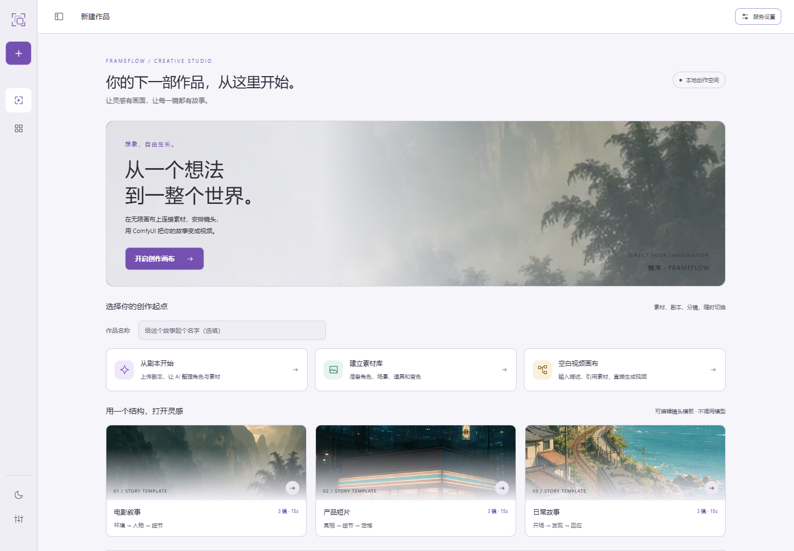

<div align="center">

# 镜序 FRAMEFLOW

**从一个想法，到一整个世界。**

在本地整理素材、编排镜头，用 ComfyUI 生成视频，再把选中的版本拼成作品。

`Python 3.10+` · `FastAPI` · `Vue 3` · `ComfyUI / MiniMax-H3`

</div>

## 项目介绍

镜序是一个以素材和视频节点为核心的 AI 短片创作工作台。你可以从空白画布、三镜模板、已有剧本或素材库开始，每个视频节点同时保存描述、参考素材、生成参数和视频版本。

- **素材工坊**：管理角色、场景、道具、其他图片和音色；支持上传、编辑、AI 生成、批量生成和历史版本。
- **无限画布**：移动节点、连接参考、缩放定位、添加便签、撤销重做，以及导入 / 导出画布备份。
- **素材引用**：输入 `@` 选择当前视频已连接的图片素材，插入可读标签；缩略图带序号，悬停可放大查看。
- **提示词编排**：把当前描述、文字前情和真实参考编号交给文本模型，按工作流规则编排；也可选择英文直出。
- **视频参考与续拍**：Ref2VA 可以读取已有成功视频的参考片段，或从所选视频的最后有效帧开始下一段。
- **版本与候选**：单次生成 1 / 2 / 4 个候选，切换、下载或并排对比；重新生成保留已有成功版本。
- **逐镜队列与成片**：按镜头依赖串行生成，支持暂停、继续和刷新恢复；选定版本后在本地合并导出。
- **白天 / 夜间模式**：侧栏底部切换，刷新后保留选择；画布、素材工坊、输入框和弹窗同步适配。

| 创作工作室 · 夜间 | 创作画布 · 夜间 |
| --- | --- |
|  |  |



截图使用离线演示素材。测试验证功能与请求链路，真实视频质量、人物一致性和续拍接缝仍需要使用实际 ComfyUI / H3 服务评估。

## 快速开始

### 1. 准备环境

- Python **3.10+**。
- Node.js **20.19+ 或 22.12+**，用于前端开发和构建。
- `imageio-ffmpeg` 随 Python 依赖安装，为本地裁片、尾帧提取和成片合并提供 FFmpeg。
- 需要生成视频时，准备可访问的 ComfyUI 实例及对应 H3 模型，或兼容的视频 API。

ComfyUI 可以部署在另一台 GPU 机器。只编辑作品、整理素材和编排画布时，无需启动 ComfyUI。

### 2. 安装依赖

```sh
git clone https://github.com/wenliu3/jingxu-frameflow.git
cd jingxu-frameflow
python -m venv .venv
```

激活环境：Windows PowerShell 使用 `.\.venv\Scripts\Activate.ps1`；macOS / Linux 使用 `source .venv/bin/activate`。

```sh
python -m pip install -r requirements.txt
npm ci --prefix web
```

### 3. 启动前后端

在项目根目录打开两个终端。

终端一：

```sh
python -m uvicorn server.app:app --host 127.0.0.1 --port 8000
```

终端二：

```sh
npm run dev --prefix web
```

浏览器打开 [http://127.0.0.1:5173](http://127.0.0.1:5173)。开发服务器把 `/api` 和 `/files` 请求代理到后端的 8000 端口。

只运行一个服务时，先构建前端，再启动同一个后端命令：

```sh
npm run build --prefix web
python -m uvicorn server.app:app --host 127.0.0.1 --port 8000
```

打开 [http://127.0.0.1:8000](http://127.0.0.1:8000)，后端会提供 `web/dist` 中的页面。

### 4. 填写服务设置

点击侧栏底部的「服务设置」；作品内也可从右上角的 ComfyUI / 服务设置入口打开。

| 服务 | 用途 | 何时需要 |
| --- | --- | --- |
| 文本模型 | 剧本规划、素材描述、AI 提示词编排 | 使用这些 AI 功能时；支持配置地址、密钥和模型名称 |
| 图片模型 | AI 生成角色、场景、道具等素材图 | 使用 AI 出图时；自行上传素材可跳过 |
| 视频服务 | ComfyUI H3 工作流或外接视频 API | 提交视频生成时 |
| 音频服务 | edge-tts 或 MiniMax 角色音色样本 | 准备角色音色时 |

配置保存到本机 `service_config.json`，保存后生效。「测试连接」只检查当前填写的 ComfyUI 地址，与保存操作独立；修改后需点击「保存设置」。也可参考 [.env.example](.env.example) 设置环境变量，优先级为保存配置、环境变量、内置默认值。

**最少配置路线**：自行上传图片，填写 ComfyUI 地址与工作流，使用「英文直出」编写提示词。此路线不调用文本或图片模型。

## ComfyUI 与视频工作流

当前画布提供以下视频服务选择：

| 选择 | 图片输入 | 视频来源输入 | 适用方式 |
| --- | --- | --- | --- |
| ComfyUI · I2V | 一张首帧图 | 文字前情 | 让已有画面动起来 |
| ComfyUI · Ref2VA | 最多 9 张参考图 | 最多 3 个视觉视频来源 | 结合角色、道具、场景与视频片段创作 |
| 外接视频 API | 一张首帧图 | 文字前情 | 使用兼容异步视频任务协议的服务 |

一镜最多引用一个场景。画布当前接入图片与视频视觉参考；素材工坊的音色样本可单独管理，画布暂未开放参考音频输入。生成音频开关控制输出音轨，不等同于上传音色参考。

在「服务设置 → 视频生成」中选择工作流，并匹配模型与加速 LoRA。Ref2VA 使用独立的权重和工作流，不能只切换前端名称而不准备模型。提交前会检查远端节点和模型是否就绪。

仓库内的工作流位于 `comfyui/`：`h3_i2v_api.json`、`h3_r2v_api.json`，以及用于 ComfyUI 界面查看的 `h3_r2v_ui.json`。

部署脚本：

```sh
# Linux GPU 服务器
bash deploy_comfyui.sh /root/autodl-tmp/comfyui

# PAI-DSW / ModelScope 环境
bash deploy_comfyui_ms.sh
```

模型安装、磁盘检查与实例重启见 [新实例安装教程](docs/setup-new-instance.md)；Ref2VA 配置见 [Ref2VA 指南](docs/REF2VA.md)；远程访问见 [ComfyUI 隧道指南](docs/comfyui-tunnel-guide.md)。不同平台的资源、额度与隧道有效期以其当前说明为准。

外接 API 使用硅基流动风格的异步任务协议，首帧以 base64 提交；其他协议需适配 `ApiVideoProvider`。界面会禁用该服务不支持的画幅、像素预算和精确时长控制，实际输出以模型响应为准。

## 第一次创作

1. **创建作品**：填写名称，从空白画布、镜头模板、剧本或素材开始。
2. **准备素材**：上传图片，或为素材写描述后点击「AI 生成」。批量生成会保留失败项，便于重试。
3. **创建视频**：点击画布底部浮动栏或镜头序列中的加号。空白处左键框选素材，拖动节点或组框整体移动；中键或空格＋左键平移画布。
4. **连接参考**：点击素材节点右侧圆点，再点击目标视频框；多选后可打组、复制或「一起连接」到目标视频。选中关系的连线轻微流动，其他连线淡化。也可在视频输入框中点击「参考素材」或上传图片、视频。视觉视频参考需 ComfyUI · Ref2VA。未生成的预览保持为空，参考图显示在输入框的缩略图条中。
5. **描述新画面**：点击视频节点，在它下方的输入框中写人物动作、场景与运镜。输入 `@` 只选择本视频已连接的素材，不会把素材库中的其他素材自动加进来。
6. **设置与生成**：调整时长、画幅、清晰度、音频和候选数量，点击生成箭头或按 `Ctrl+Enter`。结果回到当前视频节点。
7. **选择与导出**：切换或对比候选，点击「导出视频」，勾选镜头与版本；可下载带镜头序号的原视频 ZIP 自行剪辑，也可按序合成一条成片。

例如先连接「云糯糯」「旧铁剑」「深山古道」，再通过 `@` 菜单插入对应标签：

> @云糯糯 手持 @旧铁剑，沿着 @深山古道 缓缓上行。晨光穿过薄雾，镜头从侧后方平稳跟拍，保持一个连续镜头。

标签保存素材身份，后端按本次真实输入生成对应编号。断开素材后，相关标签会标红并阻止提交，重新连接或删除标签即可继续。

### AI 编排和英文直出

- **AI 编排**：输入中文或自然语言描述。文本模型结合所选素材、前情和本地 H3 规则精要写提示词，后端校验参考编号、结构与时间轴；不合规时纠正一次，仍失败则停止提交。
- **英文直出**：使用你写的英文正文，跳过文本模型。后端仍进行参考解析和结构校验；Ref2VA 正文会补齐所需结构，完整合规提示词保留。

本地规则精要参考 H3 提示词指南，由项目维护，不是调用官方的在线提示词服务。文本模型接收描述和参考信息；视频视觉内容通过工作流交给 H3。输入清晰、素材一致、动作量符合片段时长，有助于减少歧义；编排规范不能保证每次生成质量。详细链路见 [提示词编排说明](docs/h3-prompt-pipeline.md)。

### 引用前一段视频

可点击画布左侧「上传参考视频」、视频输入框中的「上传视频」，或把视频拖入画布。支持 MP4、MOV、WebM、MKV、M4V，每个不超过 100MB、两分钟，上传后会转换为可播放的 MP4 并生成预览。参考视频保存到当前作品，刷新后仍可使用。

把成功的视频节点或上传的参考视频连接到下一张视频节点，在输入框的来源卡片中选择用途；参考范围与续拍细节按需展开：

| 用途 | 实际输入 | 使用方法 |
| --- | --- | --- |
| 仅文字前情 | 来源描述 | 延续剧情背景，视觉输入不包含来源片段 |
| 视频参考 | 所选成功版本的参考片段 | 借鉴画面、人物、动作或运镜，可调整参考范围 |
| 从结尾续拍 | 来源最后有效帧作为新片开头引导，可附结尾动态参考 | 写下接下来发生的内容，生成新的片段 |

Ref2VA 最多使用 3 个视觉视频来源，但同一新视频只能有 **1 个续拍起点**；其他来源可设为视频参考或文字前情。两个视频参考可以共同输入，但不能同时从两个不同结尾开始。

选中成功视频后，加号菜单也可选择「续拍当前视频」，自动创建并连接下一镜。创建、连线和选择用途都不会自动提交生成。

来源必须是当前作品中已有的成功版本或本地上传视频。上传参考视频独立于生成队列和成片镜头，不会被自动生成或导出。提交前固定版本、参考范围和文件指纹；上游随后换版本不会改变已经提交的任务。续拍时长表示**新增片段**时长，不包含原视频。参考片段会按工作流帧数约束裁切，当前不复用来源音轨。见 [视频参考与续拍说明](docs/video-continuation-plan.md)。

### 参数、队列与版本

ComfyUI 单镜时长为 **1–15 秒**；提供 Auto、16:9、4:3、1:1、3:4、9:16、21:9 画幅，以及 480P、720P 和自定义像素预算。像素预算控制生成尺寸，不是画面质量承诺；启用精确时长时，本地会对输出进行裁切或补帧。

1 / 2 / 4 个候选使用独立种子串行生成。部分失败时保留成功结果与失败记录；重新生成追加版本，不覆盖旧成片。

队列按依赖关系逐镜提交。暂停只停止后续镜头，已经提交的任务继续完成。刷新后可恢复已提交任务的查询；尚未提交的队列需主动继续。任务或保存失败时暂停后续提交。后端重启不会自动重新提交未完成任务，避免重复生成。

导出按镜头连接顺序采用所选成功版本，统一为 24fps，可导出横屏、竖屏或方形；保留可用音轨，无声片段补静音。原视频文件保留，导出尺寸是本地合并尺寸。完整操作与快捷键见 [画布指南](docs/storyboard-canvas.md)。

## 本地保存与备份

```text
outputs/<task_id>/
├─ project.json              # 作品与素材信息
├─ workflow.json             # 节点、连线、视口、队列与版本
├─ characters/               # 角色图与音色样本
├─ assets/                   # 场景、道具和其他素材
├─ video_uploads/            # 上传的参考视频、预览图与记录
├─ segments/                 # 生成视频与对应记录
│  ├─ .jobs/                 # 可恢复的候选任务记录
│  └─ .references/           # 视频参考片段与尾帧缓存
└─ export/                   # 合并成片
```

画布自动保存，多个页面编辑时通过版本号避免旧页面覆盖新内容。保存失败会提示并保留浏览器暂存，可重试或导出 JSON 备份。

删除作品先移入 `outputs/_trash/`，可从回收站恢复。画布备份只包含编排数据，不包含素材与成片文件；完整备份应同时保存 `outputs/`。导入其他画布会重新编号并清除外部任务与成片绑定，之后需重新核对素材。

`service_config.json`、`.env`、作品文件、依赖目录和构建产物均被 Git 忽略。服务默认绑定本机地址；本项目没有多用户登录与权限体系，服务配置也不应公开到公网。

## 命令行与诊断

原有 CLI 流水线与历史作品兼容入口仍保留：

```sh
python main.py "雨夜便利店的一场重逢" --shots 6 --text-only
python main.py "赛博朋克城市的清晨" --shots 8 --ratio 9:16
python video_agent.py outputs/<task_id>
python doctor.py
```

CLI 中的 AI 操作和诊断连通性检查可能调用实际服务。`python doctor.py --image` 会真实生成一次图片并消耗对应额度。

## 开发与验证

前端组件、画布逻辑、请求约束、任务执行和文件保存分开维护。模块职责见 [代码整理说明](docs/code-organization.md)，测试环境与历史诊断工具见 [开发指南](dev/README.md)。

```sh
python -m pip install -r requirements-dev.txt
npm ci --prefix web
npm run check --prefix web
npm run format:check --prefix web
npm run test --prefix web
npm run build --prefix web
python -m unittest discover -s dev/api -p "test_*.py"
```

浏览器验收先安装 Chromium，再启动前端开发服务器：

```sh
npm run browser:install --prefix web
npm run dev --prefix web
# 另一个终端
npm run test:browser --prefix web
```

浏览器测试拦截全部 API，不修改真实作品、不调用付费模型；后端测试使用临时目录和本地测试视频。可用 `E2E_URL` 修改测试地址，用 `CHROME_PATH` 指定浏览器，用 `PYTHON` 指定测试视频生成使用的 Python。没有真实 ComfyUI 时，这些检查不代表已验证远端模型效果。

## 常见问题

**页面能打开，但素材或作品读不出来？** 先确认后端的 8000 端口已启动。开发页面的接口和素材请求依赖后端代理。

**ComfyUI 没启动还能使用吗？** 可以编辑作品、素材和画布；提交生成前需启动服务并通过连接与模型检查。

**视频参考为什么不能选择？** 确认服务使用 Ref2VA，来源属于当前作品且有成功版本。未完成、文件缺失或失败候选不会作为视觉输入。

**为什么有音色素材却不能连入视频？** 当前画布未接入音频参考。视频的音频开关只控制本次输出音轨。

**生成失败从哪里查看？** 查看输入框、队列和生成记录中的错误；远端连接、缺少节点 / 模型、提示词校验和本地保存失败会分别提示。依赖镜头失败后先解决来源，再继续队列。

**刷新或重启后作品还在吗？** 作品保存在 `outputs/`。成功成片保留，未完成任务不会在重启时自动重复提交。

**如何切换白天模式？** 点击侧栏底部太阳 / 月亮图标。手机上先展开顶部导航菜单。选择保存在当前浏览器。

## License

[MIT License](LICENSE)。外部模型、服务和生成内容的使用条件以对应提供方的许可与条款为准。
